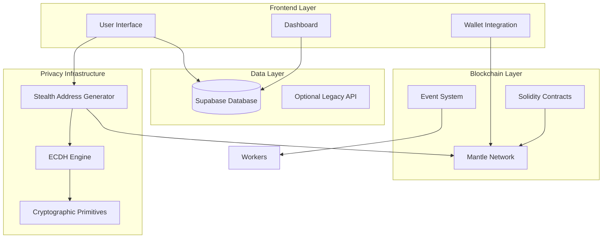
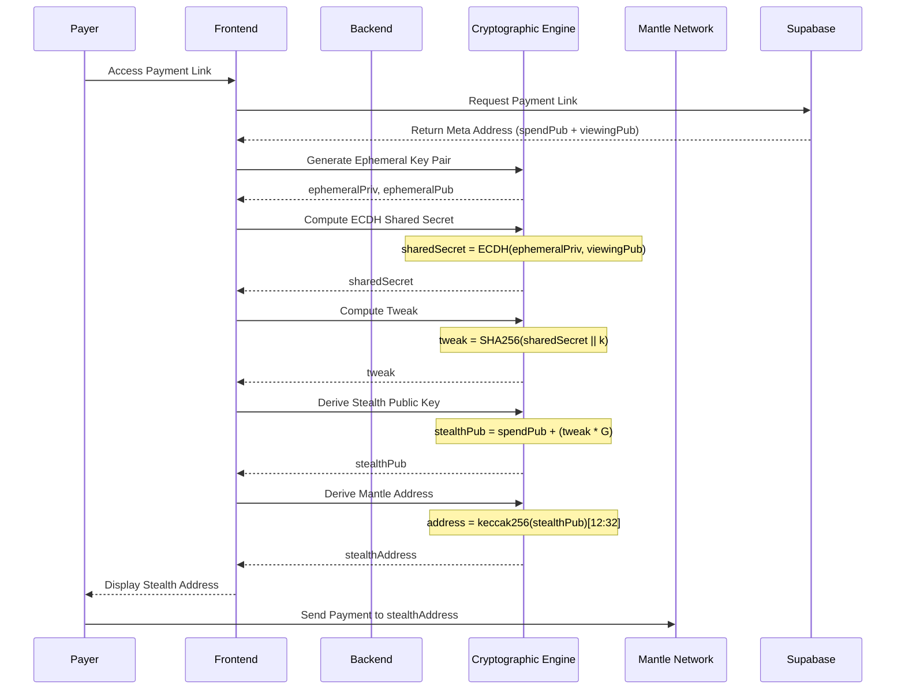
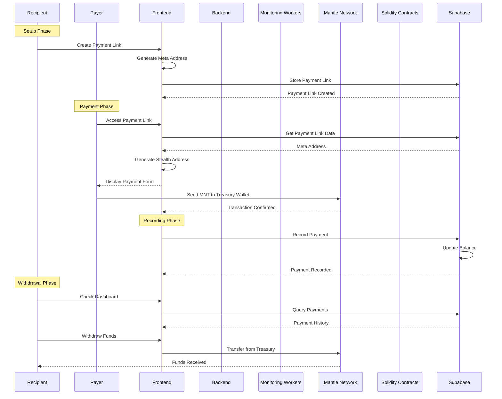
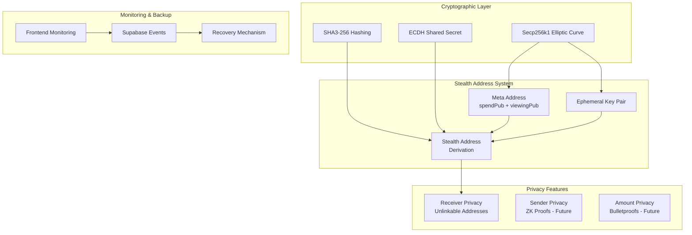
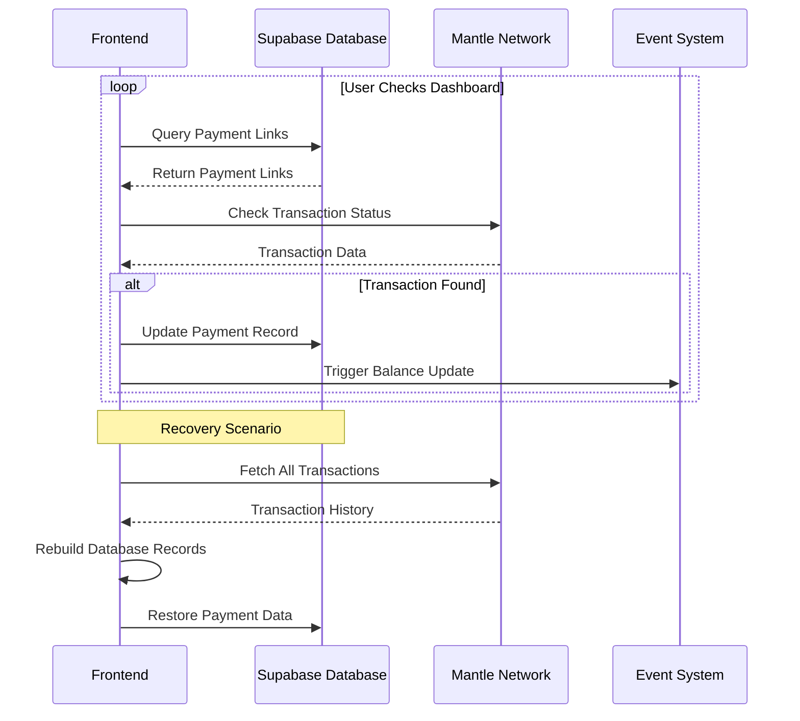
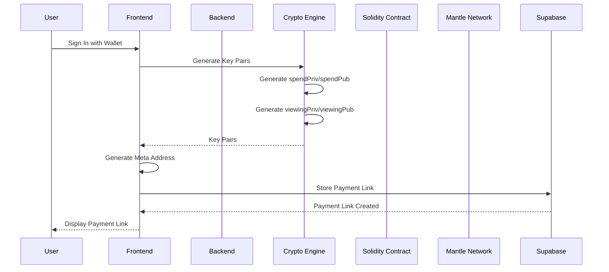
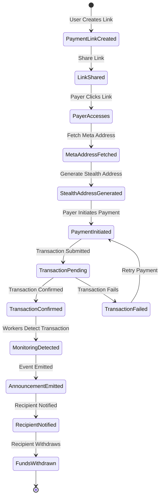
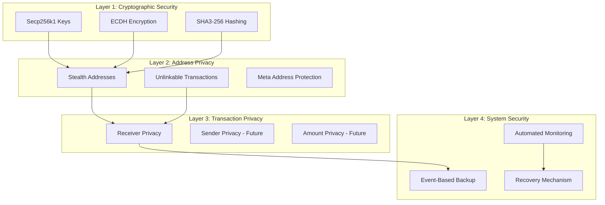

# Private-Pay 🐙

> **The first on-chain untraceable, unidentifiable private payments on Mantle Network**

[](https://www.mantle.xyz/)
[](https://www.typescriptlang.org/)
[](https://soliditylang.org/)

**Simply means:** Stealth Crypto Payments using multilayer forks

Powered by ECDH + secp256k1 + BIP 0352/EIP 5564 + ROFL DarkPool Mixer

---

## 🚨 The Problem: Financial Privacy is Broken

### Real-Life Story

**Alice**, a legendary dev, won the Move AI Hack and received $13,000 prize money.

**Bob**, another participant who won another prize in the same hackathon, discovered his co-founder wasn't trustworthy about receiving prize money. Bob texted all 12 winners asking for the organizer's wallet address. Within minutes, using blockchain explorers and intelligence tools, he identified:
- Which wallet belonged to whom
- Exactly how much each person received
- Their entire transaction history

**This is a serious concern.** Nobody wants their wallet exposed — it makes them vulnerable to targeted attacks, extortion, and financial loss.

### The Core Issues

❌ **Payments on public blockchains are NOT private**
- Traceable through tools like Arkham Intelligence
- Trackable via Dune Analytics and explorers
- Identifiable by anyone with basic skills

❌ **Results:**
- Fear of transacting
- Inconvenience for legitimate users
- Financial loss from targeted attacks
- Privacy violations for everyone

---

## ✅ The Solution: PrivatePay


**Where every transaction is fully private, anonymous, unidentifiable, and untrackable.**

### Core Benefits

- ✨ **Sender privacy**: Your wallet is never linked to the transaction
- ✨ **Receiver privacy**: Recipients' identities remain hidden
- ✨ **Observer blindness**: Third parties see nothing linkable
- ✨ **Simple UX**: Like Stripe links, but every transaction is a new, invisible wallet

### Comparison with Other Privacy Solutions

| Protocol | Privacy Type | UX | Scalability | Stealth Links |
|----------|-------------|-----|------------|--------------|
| **Tornado Cash** | Mixer | Poor | ⚠️ Limited pools | ❌ |
| **Railgun / ZK Mixers** | ZK Circuits | Heavy friction | ⚠️ High gas costs | ❌ |
| **Monero / Zcash** | Full chain privacy | Not composable | ⚠️ Separate chains | ❌ |
| **PrivatePay** | Link-based stealth | ✅ Simple | ✅ Unlimited | ✅ |

### Key Features

🔒 **Infinite Untraceable Stealth Accounts**
- Each payment generates a fresh stealth sub-account
- Unlimited transactions, unlimited mixers
- One single DarkPool

💼 **Static Payment Links**
- Share a single payment link (e.g., `amaan.privatepay.me`)
- Each access generates a unique stealth address
- No complex setup required

🔐 **Complete Unlinkability**
- Sender cannot identify receiver
- Receiver cannot identify sender
- Observers see nothing linkable

📱 **Progressive Web App (PWA)**
- Install on mobile and desktop devices
- Offline functionality with service worker caching
- Push notifications for payment received events
- Native app-like experience

📲 **Mobile Wallet Support**
- Full iOS MetaMask mobile app integration
- Android MetaMask support
- Seamless deep linking and auto-connect
- Optimized mobile connection flow
- Works in MetaMask's in-app browser

🎯 **Points & Rewards System**
- Earn points for various actions (payments, logins, etc.)
- Leaderboard and rewards tracking
- Level-based progression system

---

## 🚀 How It Works

### Three-Step Process

#### 1. Create Payment Link 🔗
- User creates static payment link (e.g., `amaan.privatepay.me`)
- System generates meta address (static identifier)
- Link can be shared publicly without privacy risk

#### 2. Receive Payment 💸
- Payer accesses link → generates unique stealth address
- Payment sent to stealth address on Mantle Network
- Transaction is unlinkable to recipient's identity

#### 3. Manage Funds 💰
- Recipient monitors stealth addresses automatically
- Funds can be withdrawn to main wallet
- Full transaction history in private dashboard

---

## 🔧 Technology Stack

### Privacy Infrastructure

```
🔐 Cryptographic Primitives
├─ Secp256k1 elliptic curve cryptography
├─ SHA3-256 hashing for address derivation
└─ Secure random number generation

🤝 ECDH (Elliptic Curve Diffie-Hellman)
├─ Shared secret computation
├─ Key exchange protocol
└─ Perfect forward secrecy

🎭 Stealth Address Protocol (SSAP)
├─ Adapted from BIP 0352 / EIP 5564
├─ Unique address per transaction
└─ Complete unlinkability

🌊 DarkPool Mixer (In Progress)
├─ Runtime Offchain Logic (ROFL) integration
├─ Homomorphic encryption
└─ Monero-style Ring Signatures & RingCT

🔍 Automated Monitoring
├─ Frontend-based transaction detection
├─ Supabase event system
└─ Resilient recovery mechanism
```

### Built With

- **Blockchain**: Mantle Network (Solidity smart contracts)
- **Frontend**: React + Vite
- **Database**: Supabase (PostgreSQL)
- **Cryptography**: @noble/secp256k1, @noble/hashes
- **Wallet**: MetaMask (Desktop & Mobile iOS/Android support)
- **Mobile SDK**: MetaMask SDK for seamless mobile wallet integration
- **PWA**: Progressive Web App with offline support & push notifications
- **State Management**: Zustand, Jotai
- **UI Framework**: NextUI, Tailwind CSS
- **Charts**: Recharts

---

## 📊 Market Opportunity

### Total Addressable Market (TAM)

| Market | Size | Growth |
|--------|------|--------|
| 💰 Global payment processing | $160B annually | - |
| 🪙 Crypto payment market | $624M | 16.6% CAGR |
| 🔒 Privacy-focused solutions | $1.2B | Growing |
| 👥 Crypto users worldwide | 590M+ | Expanding |

### Target Users

- **Individuals**: Privacy-conscious crypto users
- **Freelancers**: Receive payments without exposing income
- **Businesses**: Accept payments without revealing revenue
- **DAOs**: Anonymous treasury management
- **Hedge Funds**: Private money movements
- **High Net Worth**: Protection from targeted attacks

---

## ⚡ Future Roadmap

### Phase 1: Core Platform ✅
- ✅ Stealth address generation
- ✅ Payment link system
- ✅ Dashboard and monitoring
- ✅ Mantle wallet integration (Desktop & Mobile)
- ✅ iOS/Android MetaMask mobile app support
- ✅ Progressive Web App (PWA) with offline support
- ✅ Points & rewards system

### Phase 2: Enhanced Privacy 🚧
- 🚧 Zero-knowledge proofs (Plonky2)
- 🚧 Bulletproofs for amount hiding
- 🚧 Advanced DarkPool integration
- 🚧 ROFL-style monitoring

### Phase 3: Payment Expansion 🔮
- 🔮 Private credit and debit card payments
- 🔮 Private cross-chain bridges
- 🔮 Disposable wallets

### Phase 4: Enterprise Features 🔮
- 🔮 Hedge fund money moves
- 🔮 API marketplace
- 🔮 White-label solutions
- 🔮 Compliance tools

### Endless Possibilities
- No more "James Waynn Exposer" incidents
- End to HyperLiquid wallet reveals
- Protection for high-value transactions
- Privacy for everyone, everywhere

> 📋 **See [FEATURE_ROADMAP.md](./FEATURE_ROADMAP.md) for 20+ additional features we can build!**

---

## 🏗️ Architecture

### System Overview

```
┌─────────────────┐
│   User Wallet   │
│ (MetaMask/Mantle)│
└────────┬────────┘
         │
         ▼
┌─────────────────┐
│    Frontend     │
│  (React + Vite) │
└────────┬────────┘
         │
         ├──────────────────┐
         ▼                  ▼
┌─────────────────┐  ┌──────────────────┐
│ Stealth Address │  │   Supabase DB    │
│    Generator    │  │  (PostgreSQL)    │
└────────┬────────┘  └──────────────────┘
         │
         ▼
┌─────────────────────────────────┐
│      Mantle Network             │
│  ┌──────────────────────────┐   │
│  │  Solidity Smart Contracts│   │
│  │  - StealthAddressRegistry│   │
│  │  - Payment Manager       │   │
│  └──────────────────────────┘   │
└─────────────────────────────────┘
```

### Cryptographic Flow

```
1. Meta Address Generation
   ├─ Generate spend key pair (spendPriv, spendPub)
   ├─ Generate viewing key pair (viewingPriv, viewingPub)
   └─ metaAddress = (spendPub, viewingPub)

2. Stealth Address Generation
   ├─ Generate ephemeral key pair (ephemeralPriv, ephemeralPub)
   ├─ Compute shared secret: ECDH(ephemeralPriv, viewingPub)
   ├─ Compute tweak: SHA256(sharedSecret || k)
   ├─ Derive stealth public key: stealthPub = spendPub + (tweak * G)
   └─ Derive Mantle address: keccak256(stealthPub)[12:32]

3. Payment Detection
   ├─ Recipient computes: ECDH(viewingPriv, ephemeralPub)
   ├─ Checks view hint matches
   ├─ Derives stealth address
   └─ Checks blockchain for funds

4. Fund Withdrawal
   ├─ Compute stealth private key: stealthPriv = spendPriv + tweak
   ├─ Sign transaction with stealthPriv
   └─ Transfer funds to main wallet
```

---

## 📐 Detailed Architecture Diagrams

### 1. High-Level System Architecture



### 2. Stealth Address Generation Flow



### 3. Payment Flow - Complete Process



### 4. Privacy Infrastructure Stack



### 5. Monitoring & Recovery System



### 6. User Registration & Meta Address Setup



### 7. Payment Link to Transaction Flow



### 8. Security & Privacy Layers



---

## 🚀 Getting Started

### Prerequisites

- Node.js 18+
- MetaMask Wallet (configured for Mantle Network)
- Supabase account

### Installation

1. **Clone the repository**
```bash
git clone https://github.com/AmaanSayyad/Private-Pay-Mantle.git
cd Private-Pay-Mantle
```

2. **Install dependencies**
```bash
npm install
```

3. **Configure environment variables**

Create a `.env` file in the root directory:
```env
# Supabase Configuration (Required)
VITE_SUPABASE_URL=your_supabase_url
VITE_SUPABASE_ANON_KEY=your_supabase_anon_key

# Treasury Wallet (Required)
VITE_TREASURY_WALLET_ADDRESS=your_treasury_wallet_address

# Website Configuration (Required)
VITE_WEBSITE_HOST=privatepay.me

# Mantle Network Configuration (Optional - has defaults)
VITE_MANTLE_TESTNET_RPC_URL=https://rpc.sepolia.mantle.xyz
VITE_MANTLE_TESTNET_CHAIN_ID=5003
VITE_MANTLE_TESTNET_EXPLORER_URL=https://sepolia.mantlescan.xyz
VITE_MANTLE_STEALTH_REGISTRY_ADDRESS=your_stealth_registry_address
VITE_MANTLE_PAYMENT_MANAGER_ADDRESS=your_payment_manager_address

# App Environment (Optional)
VITE_APP_ENVIRONMENT=dev

# Dynamic Wallet Integration (Optional)
VITE_DYNAMIC_ENV_ID=your_dynamic_environment_id

# Legacy Contract Address (Optional - for backward compatibility)
VITE_STEALTHSIGNER_CONTRACT_ADDRESS=your_contract_address

# Treasury Private Key (Optional - for automated withdrawals)
VITE_TREASURY_PRIVATE_KEY=your_treasury_private_key

# Paymaster (Optional)
VITE_PAYMASTER_PK=your_paymaster_private_key

# Legacy Backend API (Optional - for legacy features)
VITE_BACKEND_URL=your_backend_api_url

# Infura API Key (Optional - for other EVM chains)
VITE_INFURA_API_KEY=your_infura_api_key

# Local Development (Optional)
VITE_ENABLE_LOCAL_DNS=false
```

4. **Run the application**
```bash
npm run dev
```

5. **Run database migrations**
   - Go to your Supabase SQL Editor
   - Run `supabase/migrations/000_apply_all_migrations.sql`
   - See [SUPABASE_SETUP.md](./SUPABASE_SETUP.md) for detailed instructions

6. **Access the app**
   - Application: http://localhost:5173
   - PWA features: Install the app from your browser for native experience

> 📚 **Need help?** Check out [QUICK_START.md](./QUICK_START.md) for step-by-step setup instructions.

---
## 📚 Additional Documentation

- **[FEATURE_ROADMAP.md](./FEATURE_ROADMAP.md)** - 20+ features we can build
- **[SUPABASE_SETUP.md](./SUPABASE_SETUP.md)** - Supabase setup guide
- **[DEPLOYMENT_CHECKLIST.md](./DEPLOYMENT_CHECKLIST.md)** - Complete deployment checklist
- **[QUICK_START.md](./QUICK_START.md)** - Quick start guide
- **[MIGRATION_STATUS.md](./MIGRATION_STATUS.md)** - Database migration status
- **[PWA_SETUP.md](./PWA_SETUP.md)** - Progressive Web App setup and features
- **[POINTS_SYSTEM.md](./POINTS_SYSTEM.md)** - Points and rewards system documentation
- **[STEALTH_ADDRESS_ARCHITECTURE.md](./STEALTH_ADDRESS_ARCHITECTURE.md)** - Detailed stealth address architecture

---

## 🙏 Acknowledgments

### Technology

- **Mantle Network** - Modular Ethereum L2 with low fees and high performance
- **Oasis Protocol** - Inspiration from ROFL and Sapphire
- **BIP 0352 / EIP 5564** - Stealth address standards
- **@noble** libraries - Cryptographic primitives
- **Supabase** - Database and backend infrastructure
- **Vite PWA Plugin** - Progressive Web App capabilities
- **Workbox** - Service worker and caching strategies
- **MetaMask SDK** - Mobile wallet integration and deep linking
---

This project demonstrates:
- ✅ **Privacy-Preserving Payments** - Complete unlinkability using stealth addresses
- ✅ **ZK & Privacy Innovation** - Advanced cryptographic privacy without compromising UX
- ✅ **Mantle Network Integration** - Leveraging Mantle's low fees and high performance
- ✅ **Production-Ready PWA** - Installable app with offline support and push notifications
- ✅ **Mobile-First Design** - Full iOS/Android MetaMask support with seamless connection
- ✅ **User-Friendly Design** - Simple UX comparable to Stripe, but with complete privacy

---

## 📱 Progressive Web App (PWA)

PrivatePay is a fully functional Progressive Web App that can be installed on mobile and desktop devices.

### Installation

**Mobile (iOS):**
1. Open PrivatePay in Safari
2. Tap Share → "Add to Home Screen"
3. Enjoy native app experience

**Mobile (Android):**
1. Open PrivatePay in Chrome or MetaMask mobile browser
2. Tap menu → "Add to Home Screen" or "Install App"
3. Connect wallet using MetaMask mobile app
4. Launch from home screen

**Desktop (Chrome/Edge):**
1. Look for install icon in address bar
2. Click "Install" when prompted
3. App opens in standalone window

### PWA Features

- ✅ **Offline Support** - Cached assets work offline
- ✅ **Push Notifications** - Get notified when payments are received
- ✅ **Fast Loading** - Service worker caching for instant loads
- ✅ **Native Experience** - Standalone display mode
- ✅ **Auto-Updates** - Automatic service worker updates

### Mobile Wallet Connection

PrivatePay supports MetaMask on both desktop and mobile devices:

**Desktop:**
- Direct browser extension integration
- Standard MetaMask connection flow

**Mobile (iOS/Android):**
- MetaMask SDK integration for seamless mobile experience
- Deep linking to MetaMask mobile app
- Auto-connect when returning from MetaMask
- Works in MetaMask's in-app browser
- Optimized connection flow for mobile devices

> 📖 See [PWA_SETUP.md](./PWA_SETUP.md) for detailed PWA documentation

---

## 🔗 Links & Resources
- **Pitch Deck:** https://docs.google.com/presentation/d/1CZx4tTtaLhS0rbD4v0tlDC7OkFB0GPcWqbD43B9dXX0/edit?usp=sharing
- **Demo Video:** https://youtu.be/8Jwvu0nj2yA
- **Pitch Video:** https://youtu.be/p5Pgx0ZBUqA
- **Live Website:** https://private-pay-mantle-three.vercel.app/
- **Github:** https://github.com/AmaanSayyad/Private-Pay-Mantle
---

<p align="center">
  <strong>Built with 🐙 by developers who believe privacy is a fundamental right</strong>
</p>

<p align="center">
  No more wallet exposure. No more targeted attacks. No more financial surveillance.
</p>

<p align="center">
  <strong>Private-Pay: Where every transaction is invisible.</strong>
</p>
